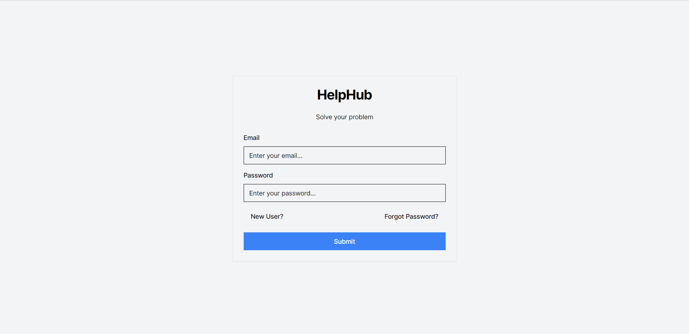
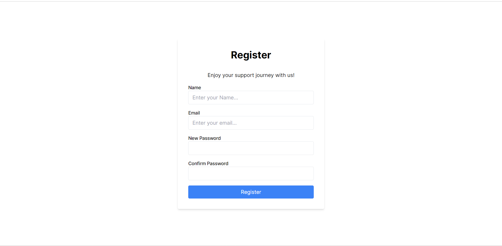
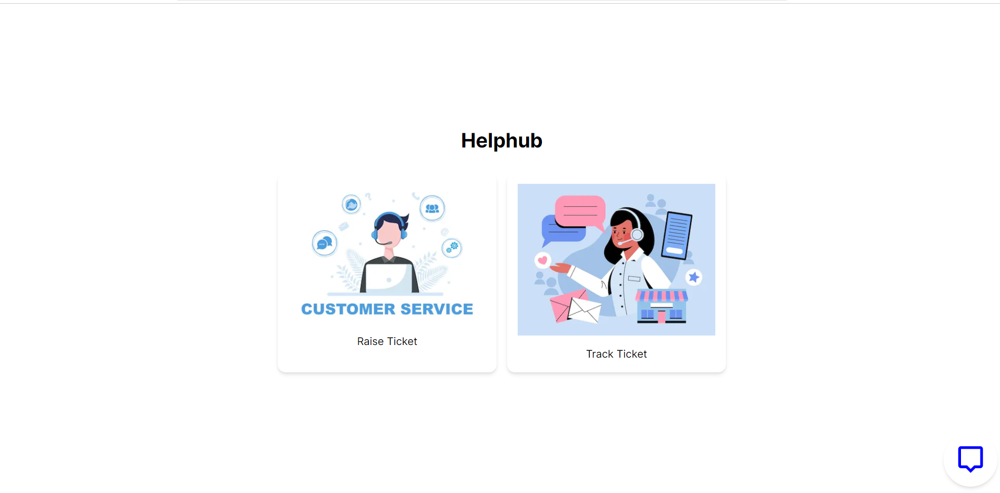
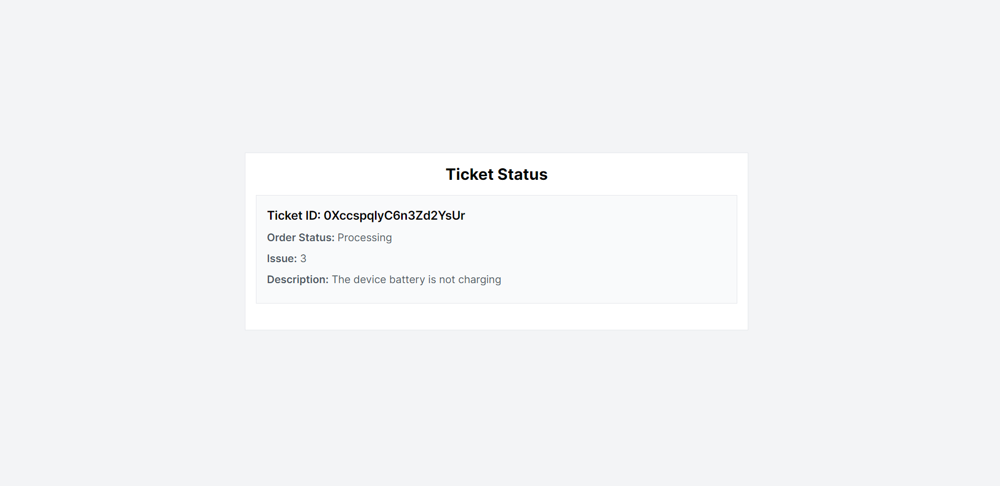
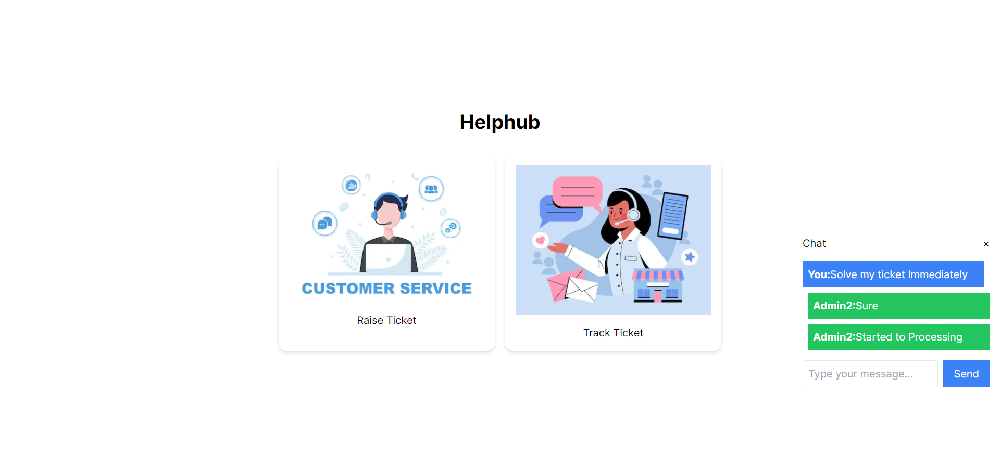

# Customer Care Support App
## Client Side Features:

1. **User Registration and Login:**
   Customers must register and log in to access the service.
   
      

2. **Raise Ticket:**
   - Customers can submit complaints through the "Raise Ticket" page.
   - Choose the appropriate issue, and the system assigns the ticket to the relevant agent.
  
     
     
3. **Track Status:**
   - Check the status of submitted tickets through the "Track Status" page.
     
      

4. **Real-time Communication:**
   - Communicate with assigned agents in real time using the messaging app.

     

